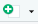
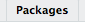
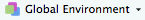
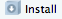

<!-- ```{r, echo=FALSE, warning=FALSE, message=FALSE} -->
<!-- htmltools::img(src = knitr::image_uri('assets/ninja-logo.jpg'),  -->
<!--                alt = 'logo',  -->
<!--                style = 'position:absolute; top:5%; right:5%; padding:10px; width:12%') -->
<!-- ``` -->

<div class="completed">
##Pre-requisites
There two things we need to do before we start the lesson.

1. [Install R](https://cran.r-project.org/): Any of the links on that page should work
2. [Install Rstudio](https://www.rstudio.com/products/rstudio/download/): Choose the option that is suited for your Operating System (OS).

##Get familiar with your working environment
When you installed R on your computer, you provide it the tools necessary to process code that is written in R. The Base R installation ships with a simple code editor that can be used to write R scripts. RStudio is a software application that builds on top of your R installation to give you additional functionality to write and manage R code and projects [^1]. It is by far the most popular integrated development environment (IDE) for R and has several features that are custom made to support data science in R.

There are four different panes on RStudio that you need to get familiar with.

1. The console: This is the pane that is usually located on the left (at the bottom if you have a script or notebook open) that can be used to type in R commands. The console is a great place to test out lines of code that doesn't necessarily have to go into the project you are woring on. The console is also the place were the output of your code are printed [^2]. The console however, is not the place to write any code that you need to rerun since it is not possible to save code that is written in the console as a file. You will need to use the code pane to do that.
2. The code: This is were you will write the majority of the code for your projects. There are several different formats in which you can write code. This pane only appears if you have an open file that you are currently working on. Click on the  button at the top left of R Studio to see the different options. We will use the first two options R Notebook and R Script for most of this course.
3. The viewer: The pane to the bottom right is where you can view plots rendered by your code, packages that are currently loaded to the environment, access help files, view documents, and access folders on your computer. Click on the  tab to scroll through the list and see all the packages that are checked. These are the packages that are pre-loaded with your session. If you don't know what packages are, don't worry, we will be covering that very soon.
4. The environment: The environment pane is the one on the top-right. This is were all the variables and functions that you create are displayed. R Studio provides additional functionality that allows users to click on these variables to view their contents. Click on  dropdown you will notice that there are several other packages that are listed there. These are the same as those that are checked in the packages tab on the viewer pane. Selecting one of them will display the entire list of functions that are currently available for you to use.

⚡***Ninja Tasks***⚡

1. Create a Numbers Ninja Folder on your local machine
2. Create an R Notebook "Class_1" and save it in this folder

[^1]: The techinical term for this type of software application is: [integrated development environment](https://en.wikipedia.org/wiki/Integrated_development_environment)(IDE).

[^2]: This is true for all formats other than those that use R Markdown. In the case script formats that use R markdown the output is printed within the script rather than in the console.

##A quick R Markdown detour
Markdown is a markup language.

From [Wikipedia](https://en.wikipedia.org/wiki/Markup_language):

>In computer text processing, a markup language is a system for annotating a document in a way that is syntactically distinguishable from the text...the whole idea of a mark up language is to avoid the formatting work for the text, as the tags in the mark up language serve the purpose to format the appropriate text (like a header or beginning of a next para...etc.). Every tag used in a Markup language has a property to format the text we write. - 

<span class="highlight">Hyper Text Markup Language</span>([HTML](https://en.wikipedia.org/wiki/HTML)) is perhaps the most well-known markup language out there [^3]. It is used to render content on websites. Go ahead and right click on any webpage and click on inspect to open up the web inspector to view the underlying HTML code that was used to generate it. <span class="highlight">Markdown</span> is a more human friendly (but limited) version of HTML. Markdown uses simple and easy to read tags to markup text which is compiled (by your computer) into HTML that can be used to render webpages. Making it easier to create content that can be rendered on a webpage for those who are unfamiliar with HTML. 

<span class="highlight">R Markdown</span> is a package in that allows us to combine markdown with R code. Using R Markdown we can create a wide variety of easy to read and reproduce R documents that contain both code and nicely formatted. This online R notebook is a case in point. 

In addition to using markdown to markup text, R Markdown documents also uses <span class="highlight">R Markdown</span>[YAML](https://en.wikipedia.org/wiki/YAML)</span>. This is the section right at the top of the notebook that is separated by the `---`. This is the part of the document were you specify the title and other characteristics of the report.

Here are a few references to keep handy

1. [R Markdown: The definitive guide](https://bookdown.org/yihui/rmarkdown/)
2. [R Markdown cheatsheet](https://www.rstudio.com/wp-content/uploads/2016/03/rmarkdown-cheatsheet-2.0.pdf)

⚡***Ninja Tasks***⚡

1. Create an H2 level header with title Class 1 Exercises
2. Write the following text: "The list below shows the exercises for this class"
3. Create an ordered list with following list items: "1. Practice Shortcuts" "2. Practice dplyr"
4. Click on the preview button at the top left of the IDE to preview your notebook

[^3]: Some other examples include - [TeX](https://en.wikipedia.org/wiki/TeX) and [LaTeX](https://en.wikipedia.org/wiki/LaTeX). TeX is the markup language that used as a [typesetting system](https://en.wikipedia.org/wiki/Typesetting) in computers for high quality books. LaTeX is used extensively in academia to create documents. 

##Shortcuts
Before we move on, lets learn a few shortcuts.

1. `Cmd + Option + I` or `Ctrl + Alt + I`: Insert a chunk in markdown/notebook etc
2. `Option + -` or `Alt + -`: Enter the assignment operator
3. `Cmd + Enter` or `Ctrl + Enter`: Run current line/selection
4. `Cmd + Shift + Enter` `Ctrl + Shift + Enter`: Run the entire script if it is a script file or the current chunk in the case of a notebook.
5. `Cmd + Shift + M` or `Ctrl + Shift + M`: Insert pipe operator

You can find more shortcut keys [here](https://support.rstudio.com/hc/en-us/articles/200711853-Keyboard-Shortcuts)

⚡***Ninja Tasks***⚡

1. Use all the shortcuts to do the following task: create a new code chunk => assign the string "Hello World" to `myFirstVar` variable => run the line of code => add a print command using `print(myFirstVar)` => run the entire chunk

##Packages
Packages that make our job as coders easier by extending the functionality of base R. Each package contains a collection of functions that we can use in our code without having to worry about needing to write and maintain them ourselves. In addition to functions, packages can also contain data or point database api (such `wbstats` which points to the World Banks data). R has an extremely rich, well maintained ecosystem of packages that contain functions and data that are relevant to almost any academic (or even trivial) topics of interest.

⚡***Ninja Tasks***⚡

1. Install the following packages - `tidyverse` and `nycflights13` using the package tab in the viewer pane (use the  button)
2. Use the `library()` function to load these two packages in the Class 1 notebook
3. Check the packages tab on your viewer to see if these packages are checked (i.e. loaded to our current environment)
4. Check the Global Environment dropdown to see that these are listed.

</div>

```{r, message=FALSE, warning=FALSE, echo=FALSE}
library(tidyverse); library(nycflights13)
```

##Tidyverse
The tidyverse is a collection of packages that follow the tidy tools philosophy. 

[The Tidy Tools Manifesto](https://tidyverse.tidyverse.org/articles/manifesto.html) by Hadley Wickham, describes the four basic principles of a tidy API as follows:

>1. Reuse existing data structures.
2. Compose simple functions with the pipe.
3. Embrace functional programming.
4. Design for humans.

There are two overarching programming concepts here that are important for us to note - composition and the use of declaritive instead of imperative code. Composition is simply the use of several smaller functions to create a more complex function. The tidyverse achieves composition through the use of pipes (`%>%`). We will learn about pipes relatively soon.

According to [Wikipedia](https://en.wikipedia.org/wiki/Declarative_programming):

> In computer science, declarative programming is a programming paradigm—a style of building the structure and elements of computer programs—that expresses the logic of a computation without describing its control flow.

This video explains this further using the real-world example of a car (albeit from the persepective of React a Javascript library).
<iframe width="560" height="315" src="https://www.youtube.com/embed/JXR2p_vtP3c" frameborder="0" allow="autoplay; encrypted-media" allowfullscreen></iframe>

The tidyverse packages are characterized by their extensive use of pipes to break down complex functions into simpler pieces that are easier to to read and understand. We will learn about pipes shortly.

⚡***Ninja Tasks***⚡

1. Read the [tidy tools manifesto](https://tidyverse.tidyverse.org/articles/manifesto.html)


##nycflight13 data
We will be using the `nycflights13` datasets package to learn data manipulation. The package contains relational datasets that offer information on all the flights that took off from 3 airports in NYC (EWR, JFK, LGA) in 2013. The different datasets in the package are as follows:

1. airlines: Names of the different airline carriers
2. airports: Meta data on the airports in the dataset
3. flights: Data on all the flights that departed NYC in 2013
4. planes: Meta data on the planes (their make, capacity etc)
5. weather: Weather at the three NYC airports on all days of 2013

For this notebook we will be using only the flights data.

##Data Manipulation using dplyr
dplyr is a package in the tidyverse collection. It provides elegant and easy to understand functions for manipulating data in R.

Keep this [data wrangling](https://www.rstudio.com/wp-content/uploads/2015/02/data-wrangling-cheatsheet.pdf) cheatsheet open on your browser as a ready reference for the rest of the notebook.

###Tibbles

A tibble is a tidy version of a data.frame. It adds a few extra features (through two new classes) that give it a few advantages over data.frames.

⚡***Ninja Tasks***⚡

1. Create a tibble (of your choice) with three observations and three variables.
2. Show the class and structure of the tibble you created.
3. Convert the mtcars data set to a tibble.

🏆***Solution***🏆

Lets create a tibble using the `tibble()` command. Check out the code below. Each input in the tibble command is a column. Notice how I have used both column vectors created within `tibble()` and an externally created the vector `hobby` inside the command. 
```{r}
hobbies <-  c("dancing", "hiking", "reading")
myFavoriteThings <- tibble(gadgets = c("Pixel", "Kindle", "Vaccum Cleaner"), books = c("Das Kapital", "Harry Potter", "Enid Blyton"), hobbies)

myFavoriteThings
```


Lets checkout the structure using the `str()` command.

```{r}
str(myFavoriteThings)
```

The tidyverse also provides a function called `glimpse()` to do the same thing as `str()`. Notice the differences between the outputs from the two commands.

```{r}
glimpse(myFavoriteThings)
```

You can access the class of any object in R using the `class()` command. Notice how there are three classes for a tibble - "tbl_df", "df" and "data.frame". Tibbles really are just data.frames with some added functionality on top that is provided by the df and tbl_df classes.
```{r}
class(myFavoriteThings)
```

`mtcars` is a part of the `datasets` package that is preloaded in R. Lets first look at its structure using `str()`
```{r}
str(mtcars)
```

As you can see the class of mtcars is a data.frame and not a tibble. We can convert it to a tibble using the `as_tibble()` command. Below, I have used this command to create a new tibble called `mtTibble`. The output shows it structure. Notice that now we have the two additional classes "df" and "tbl_df" that characterize tibbles.

```{r}
mtTibble <- as_tibble(mtcars)

str(mtTibble)
```


###The Pipe Operator

The pipe operator is a part of the `magittr` package. You can create one using the shortcuts you learnt earlier (`Cmd + Shift + M` or `Ctrl + Shift + M`). The pipe transfers the values that are to the left of it to the right side. While this might seem a bit abstract at this point, `%>%` is an excellent way to break down code into smaller pieces that are easier to read and maintain.

⚡***Ninja Tasks***⚡

1. Calculate the square root of the sum of all even numbers from 0 to 200 and create a sequence that goes from the square root to twice its value.
2. Repeat the task using base commands.

🏆***Solution***🏆

First lets do it using pipes. Notice the use of the dot on the last line of the code. When using pipes the `.` is used to refer explicitly to the data on the left side of the pipe. We do this so that we can perform operation on it. In our case, we need to create a sequence that goes from the left-hand side value to twice its value and we acheive this using `. * 2`. Note that we could have used the dot notation to refer to the data on the left hand side explicitly for each command, however, dplyr automatically assumes that you are passing the data from the left side saving us the trouble. We only need to use a `.` if we need to perform an operation or use it explicitly as a function argument.
```{r}
##create a sequence of even numbers from 0 to 200
seq(from = 0, to = 200, by = 2) %>% 
    ##calculate the sum of all values in the previous vector
    sum() %>% 
    ##calculate the square root of the value from the sum operation
    sqrt() %>% 
    ##create a new seq from the previous value to twice its value
    seq(from = ., to = . * 2, by = 2)
```

Now lets do this without the pipes. Notice how the base command combines multiple steps i.e. `sum()`, `sqrt()` and `seq()` into a single command. Code such as this is harder to read, understand and debug compared to the version that uses `%>%`.
```{r}
##create the a sequence, calculate its sum and find the square root
sqrtValue <- sqrt(sum(seq(from = 1, to = 200, by = 2)))
##create a sequence
seq(from = sqrtValue, to = 2 * sqrtValue, by = 2)
```


###Filter

Filter is the dplyr verb for subsetting rows of data based on a particular condition.


⚡***Ninja Tasks***⚡

1. Which flight out of JFK was the most delayed in 2013?
2. Answer the previous question without using dplyr or pipes.
3. What were the 5 longest flights (in air time) from NYC in 2013?

🏆***Solution***🏆

Lets find the most delayed flight out of JFK
```{r}
flights %>% 
    ##filter all flights from JFK
    filter(origin == "JFK") %>% 
    ##find the flight that had the maximum departure delay
    filter(dep_delay == max(dep_delay, na.rm = T))
```

Lets try to do this using base R. Notice how the code is far less readable in this case.
```{r}
jfkFlights <- flights[flights$origin == "JFK", ]

maxDelay <- max(jfkFlights$dep_delay, na.rm = T)

jfkFlights[jfkFlights$dep_delay == maxDelay & !is.na(jfkFlights$dep_delay), ]
```

dplyr also ships with helper function. We can use one of these `top_n` to find the flights that had the highest air times.

```{r}
flights %>% 
    top_n(air_time, n = 5)
```


###Select

Select is a dplyr verb that is used for subsetting columns.

⚡***Ninja Tasks***⚡

1. Select all the columns that are relevant for arrival and departure delays using a utility function (refer to cheat sheet)


🏆***Solution***🏆

We can combine the select verb with the `contain` helper function to achieve this task.
```{r}
flights %>% 
    select(contains("delay"))
```


###Arrange
Arrange is a verb that arranges the rows based on the values of a particular column i.e. performs a sort.

⚡***Ninja Tasks***⚡

1. Filter the top 10 most delayed flights in JFK and arrange by dep_delay (highest to lowest)

🏆***Solution***🏆

Note that I have 
```{r}
flights %>% 
    ##arrange dep_delay in descending order (high to low)
    arrange(desc(dep_delay)) %>% 
    ##filter the first 10 rows using row_number()
    filter(row_number() <= 10) %>% 
    ##select the relevant columns
    select(month, day, origin, dep_delay)
```


###Mutate
Mutate changes a tibble by adding a new column vector or changing an existing one.

⚡***Ninja Tasks***⚡

1. Create a new variable called total_delay that is the sum of the arrival delay and departure delay
2. Do the same task using Base R

🏆***Solution***🏆

```{r}
flights %>% 
    ##combine arrival delay and departure delay
    mutate(tot_delay = arr_delay + dep_delay) %>% 
    ##select all the delay columns
    select(contains("delay"))
```

Now lets repeat this using Base R.
```{r}
flights$tot_delay <- flights$arr_delay + flights$dep_delay

flights[names(flights) %in% c("dep_delay", "arr_delay", "tot_delay")]
```


###Group and Summarise
`group_by()` categorizes the data based on the grouping variable, while summarise calculates summary statistics within these groups.

⚡***Ninja Tasks***⚡

1. Create a summary table with the following characteristics for each of the origin airports.
    + Number of flights
    + Number of unique carriers
    + Average departure delays
    + Average flight times (air time)
    + Average arrival delays

🏆***Solution***🏆

Note the use of the functions `n()` and `n_distinct()`. Look up the help to understand what they do.
```{r}
flights %>% 
    ##group the data by the origin (JFK, EWR, LGA)
    group_by(origin) %>% 
    ##calculate the summary statistics of interest
    summarise(nFlights = n(),
              nCarriers = n_distinct(carrier),
              meanDepDelay = mean(dep_delay, na.rm = T),
              meanAirTime = mean(air_time, na.rm = T),
              meanArrDelay = mean(arr_delay, na.rm = T))
    
```

    

⚡***Ninja Tasks***⚡

##Homework

1. Setup a [GitHub Account](https://github.com)
2. Install [GitHub Desktop](https://desktop.github.com/)
3. Read up about [version control](https://www.atlassian.com/git/tutorials/what-is-version-control)

